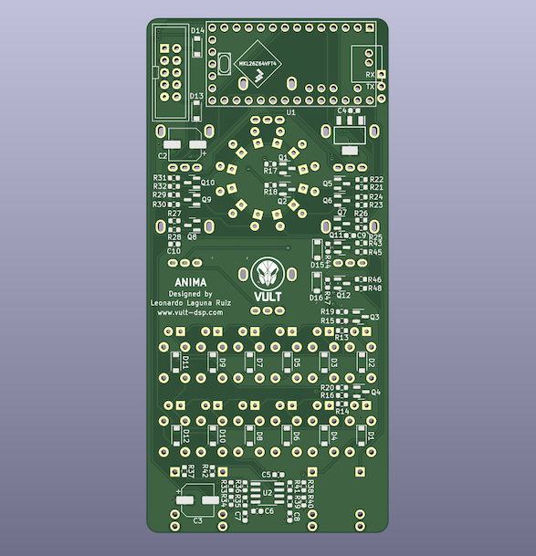

+++
title = "Anima"
description = "Psychic Sequence Generator"
date = "2022-02-04T19:33:43+02:00"
layout = "module"
image ="../images/Anima.png"
+++

<a href="/mysteries/" class="PackageButton" role="button">Part of VultMysteries</a>

Anima is my own version of the sequence generator found on the PsychTone published in February 1971 in Popular Electronics magazine. Anima provides all the features of the PsychTone except for the sound generator (which is very basic) and adds a few extra features including a Turing-Machine-like behavior.

## Getting started

Anima consists of a shift register working as pseudo random number generator algorithm. The fact that the shift register is short (6 stages) makes the sequences repeat periodically every 63 steps.

To start generating sequences you need to provide a clock signal (CLK). The sequences are generated based on 6 controls labeled: A, B, C and 1, 2, 3. Knobs 1 to 3 define the registers used to generate voltages. The knobs A to C define the voltage produced by the corresponding register (A pairs with 1, B with 2 and C with 3). Each knob has 12 positions resulting in almost 3 million different combinations. The output voltage has been adjusted so it will produce semitones (1/12 volt steps) in a three octave range (0 to 3 volts).

In order to produce Gate pulses (and also CV) you need to enable some of the PULSE/PAUSE switches. Each switch connects one of the register signals to the output. The more switches are enabled the more pulses the gate will get.

The original PsychTone provides two switches Front/Back and Up/Down. In Anima those correspond to F/B and U/D buttons. These two switches change the generation algorithm which results in different sequences being generated.

In order to restart the sequence you can send a pulse to the RST input. The reset signal can be used as well to cut short a sequence, for example, every 32 clock pulses if you need a 32 step sequence.

## Extensions available in Anima

If you need an even more varied sequence Anima provides two options: BIT4 and 6/12 buttons.

When enabling BIT4, the output voltage will be in a range of -1 to 3 volts. The voltage is generated using a phantom fourth bit (D) whose value is generated based on the positions of A, B and C. The source of the phantom bit is generated based on the positions of the knobs 1, 2 and 3.

The 6/12 button allows to select a longer register (12 stages). This makes the sequences much longer.

Anima changes the CV value only when a Gate is generated. If you want CV change every clock, you can enable the GLD (Glide) function.

### Operation modes

The MODE button allows to select a different operation mode for Anima: deterministic and non-deterministic.

The PsychTone algorithm is deterministic, which in this case means that for every combination of settings you will get the same output. In non-deterministic mode Anima will behave like a Turing machine. The probability value can be adjusted by pressing the MODE button for 2 seconds. At that point, the PULSE/PAUSE buttons are used to select a probability that goes from 0% to 100%. When selecting 0%, the sequence will be repeated indefinitely. With 100% the sequence evolves every step. Any value in-between will gradually evolve the sequence.

### Gate length

By default Anima produces a Gate pulse of the same width as the input clock. If you want to produce longer pulses you can press the GLD button for 2 seconds. At that point, the PULSE/PAUSE buttons can be used to select a different gate length based on the period of the clock. The values go from Clock-length to 100%. The period of the clock is calculated internally and takes about 5 clock pulses to stabilize.

### CV generation

Anima includes different methods to combine the generated pulses to generate the CV output. The default algorithm spreads the notes with a similar weight. In order to select a different method, you have to press the Bit4 button for 2 seconds and then you can use the PULSE/PAUSE buttons to pick a different algorithm. Each algorithm has a different probability distribution of the notes therefore making the produced sequences different. The available algorithms are:

- Default: equal weight
- Binary: each weight is twice the previous (1, 2, 4, 8)
- Primes: the weights correspond to the prime numbers (3, 5, 7, 11)
- Exponential: the weights are spaced exponentially (1, exp(1), exp(2), exp(3))
- Golden ratio: the weights are a power of the golden ratio (1 + sqrt(5))/2
- Oblate: I obtained these weights by generating random numbers until I got an interesting distribution.

### Special functions in VCV Rack

Every setting that the panel buttons reach through their press-and-hold gestures is also available directly in the context menu, obtained by right-clicking the module. This is the easier way to set them, since nothing has to be held down and the current value is shown with a checkmark.

- **Run Mode**: Deterministic or Non-Deterministic.
- **Non-Deterministic Value**: the probability used in non-deterministic mode, from 0% to 100% in steps of 20%.
- **Glide**: whether the CV changes On Gate or Always.
- **Gate Length**: Clock, or 20% to 100% of the clock period in steps of 20%.
- **Forward/Backward**: the F/B setting.
- **Up/Down**: the U/D setting.
- **Note Distribution**: Default, Binary, Primes, Exponential, Golden Ratio or Oblate.
- **Register Size**: 6 or 12 stages.
- **Bit 4**: enabled or disabled.

## Developing this module

I have been looking for the music related circuits published in old magazines. That's how I came up with the PsychTone. After looking for more information about it, I came across the video by LMNC

<iframe width="560" height="315" src="https://www.youtube.com/embed/3-iTcMpbOFE" title="YouTube video player" frameborder="0" allow="accelerometer; autoplay; clipboard-write; encrypted-media; gyroscope; picture-in-picture" allowfullscreen></iframe>

I decided to build my own box, but I was not able to find all the components. That made me think about redesigning it, for example, by replacing the 12 position switch selectors. Instead of the selectors, I planned to use an Arduino-like board to read the position of knobs and convert that to switches. But if I was going to use an Arduino, I could just implement the whole functionality on it without the need of the old ICs.

Then I decided that it would be worth designing a PCB, because that way I would not need to do a lot of wiring in order to add some LEDs and a few push buttons. Since I was going to manufacture a PCB I could manufacture a nice panel as well. In order to design the panel, I needed to have all the functionality defined, and to do that, the best thing is to prototype the module.

Here's where Rack enters. I made this module just to prototype the hardware version I'm making for myself. That's the main reason why the module does not have additional CV inputs; it is made to be used with the hands.

 

Anima PCB ready for manufacturing

If you would like to have a hardware version of Anima, send me a message or check the Vult store.

