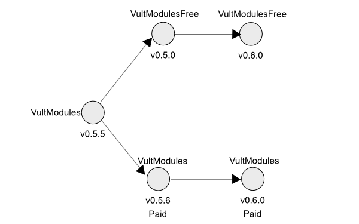

+++
title = "Download"
date = "2017-10-28T22:37:03+03:00"
layout = "module"

+++

The modules come in two versions: Free edition and Premium edition. Both versions contain over 15 high quality modules. I kept some of the modules free because I believe that everybody should have access to this creations that make me happy.

The paid modules (there are more coming) are the ones that do require more engineering and research work to develop. If you like the work I make for free, you should consider buying the paid modules to help me keep developing stuff.

The modules can be purchased from the VCV Rack store. If you don't want the paid modules, but still want to donate you can do so as well. Finally, if you just want the free modules you can download them in the github page.

<a href="https://vcvrack.com/plugins.html#Leonardo%20Laguna%20Ruiz" class="btn btn-primary" role="button">Buy</a>
<a href="https://www.paypal.me/VultModules" class="btn btn-primary" role="button">Donate</a>
<a href="https://github.com/modlfo/VultModules/releases" class="btn btn-primary" role="button">Download</a>

## Free vs Premium

Here's a short description on how the things are going to work. The Vult modules v0.5.5 is the last free release with the slug `VultModules`. The new slug will be `VultModulesFree` for the new free release. The implication of this change is that before opening your patches, you will have to manually change the slug name in the .vcv file. Use a text editor to change `VultModules` to `VultModulesFree` once the new free version is released. If you have the paid version you don't have to do anything. Within the current free modules I will make improvements that are gonna be available only in the Premium package.

I will create more free and paid modules.

**What will you get when you purchase the Premium version?** The Premium version will have 4 to 5 new complex modules plus any other free module I release. A complex module is a module that takes me a significate work to complete. For example: The filters, Caudal, Vessek and Trummor 2. While Flux, Slap, Spank are simple modules. I will release these modules in an undefined span of time, it can be from 3 months to 2 years. It will take the time it takes me to complete something that I think worths it. After I complete all the complex modules, I may release another commercial package using the same approach. I'm not sure yet.

Here's a table describing which are part of the Premium and Free package. As mentioned before, the number of Premium packages will increase as more complex modules are developed.

<table class="table">
<thead>
<tr>
<th>Module</th>
<th>Free</th>
<th>Premium</th>
</tr>
</thead>

<tbody>
<tr>
<td>Tangents</td>
<td><b>limited</b></td>
<td>yes</td>
</tr>

<tr>
<td>Stabile</td>
<td>yes</td>
<td>yes</td>
</tr>

<tr>
<td>Stabile</td>
<td>yes</td>
<td>yes</td>
</tr>

<tr>
<td>Unstabile</td>
<td>yes</td>
<td>yes</td>
</tr>

<tr>
<td>Lateralus</td>
<td><b>limited</b></td>
<td>yes</td>
</tr>

<tr>
<td>Vortex</td>
<td><b>no</b></td>
<td>yes</td>
</tr>

<tr>
<td>Rescomb</td>
<td>yes</td>
<td>yes</td>
</tr>

<tr>
<td>Julste</td>
<td>yes</td>
<td>yes</td>
</tr>

<tr>
<td>Tohe</td>
<td>yes</td>
<td>yes</td>
</tr>

<tr>
<td>Debriatus</td>
<td>yes</td>
<td>yes</td>
</tr>

<tr>
<td>Flame</td>
<td><b>no</b></td>
<td>yes</td>
</tr>

<tr>
<td>Spank</td>
<td>yes</td>
<td>yes</td>
</tr>

<tr>
<td>Slap</td>
<td>yes</td>
<td>yes</td>
</tr>

<tr>
<td>Trummor</td>
<td>yes</td>
<td>yes</td>
</tr>

<tr>
<td>Trummor 2</td>
<td>yes</td>
<td>yes</td>
</tr>

<tr>
<td>Vessek</td>
<td>yes</td>
<td>yes</td>
</tr>

<tr>
<td>Caudal</td>
<td>yes</td>
<td>yes</td>
</tr>

<tr>
<td>Flux</td>
<td>yes</td>
<td>yes</td>
</tr>

<tr>
<td>Splie</td>
<td>yes</td>
<td>yes</td>
</tr>

<tr>
<td>HyperPower</td>
<td><b>no</b></td>
<td>yes</td>
</tr>

<tr>
<td>Blank Panels</td>
<td><b>no</b></td>
<td>yes</td>
</tr>
</tbody>
</table>

<!--

| Module | Free | Premium|
|--------|:------:|:--------:|
| Tangents | limited |  yes |
| Stabile | yes |  yes |
| Stabile | yes |  yes |
| Unstabile | yes |  yes |
| Lateralus | limited |  yes |
| Vortex | no |  yes |
| Rescomb | yes |  yes |
| Julste | yes |  yes |
| Tohe | yes |  yes |
| Debriatus | yes |  yes |
| Spank | yes |  yes |
| Slap | yes |  yes |
| Trummor | yes |  yes |
| Trummor 2 | yes |  yes |
| Vessek | yes |  yes |
| Caudal | yes |  yes |
| Flux | yes |  yes |
| Splie | yes |  yes |
| HyperPower | no |  yes |
| Blank Panels | no |  yes |

-->
