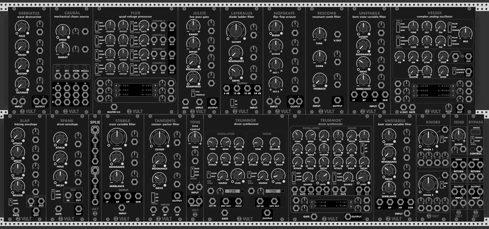
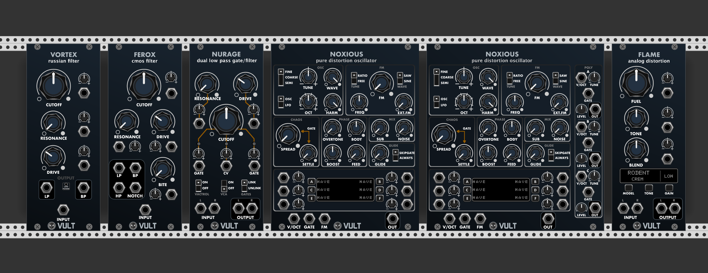
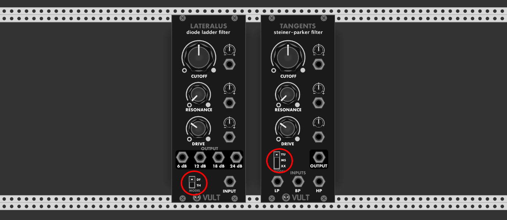

+++
title = "Download"
date = "2017-10-28T22:37:03+03:00"
layout = "download"

+++

There are two series of modules, one simply called `Vult Modules` and the new `Vult Compacts`. Both series contain some free and some paid modules. Vult Modules (free and paid) contain over 15 high quality modules. Most of my modules are free because I believe that everybody should have access to this creations that make me happy.

The paid modules are the ones that do require more engineering and research work to develop. If you like the work I make for free, you should consider buying the paid modules to help me keep developing stuff.

The modules can be purchased from the VCV Rack store. If you don't want the paid modules, but still want to donate you can do so as well. Finally, if you just want the free modules you can download them in the github page.

<a href="https://vcvrack.com/plugins.html#Vult" class="btn btn-primary" role="button">Buy</a>
<a href="https://www.paypal.me/VultModules" class="btn btn-primary" role="button">Donate</a>
<a href="https://github.com/modlfo/VultModules/releases" class="btn btn-primary" role="button">Download</a>

## Vult Modules (Free and Premium)

The Free  and Premium versions contains the following modules among which you can find:

- Two drum synthesizers
- Six filters
- One oscillator
- One chaos source
- Two envelopes
- One low pass gate
- Two utilities
- Two effects

 

## Vult Modules Premium

The paid Vult Modules (Premium) contains all the free modules plus some of the most complex modules I have developed:

 

In addition, Vult Modules Premium contains 3 extra filters which are alternative models for Lateralus and Tangents.

 

Finally, the Premium version contains 4 blank panels (HyperPower can be considered a blank).

 

## Vult Compacts

Vult Compacts is a new series that will contain free and paid modules. The idea behind the Compacts is to create alternate versions of the existing modules and expand/redesign the functionality. For example: the new Freak filter contains all Vult filters in a single package.

These are some of the modules that are planed for the paid version of Vult Compacts:

- Trummor Kit: new percussion synthesizers derived from Trummor 2.
- Full Synth Voice: a Vult synthesizer in a single package.

 

