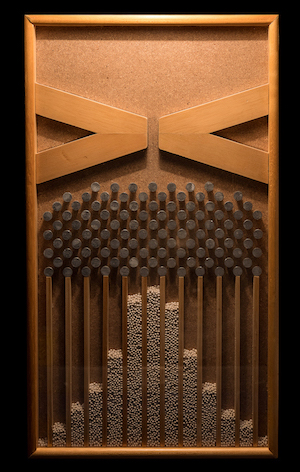
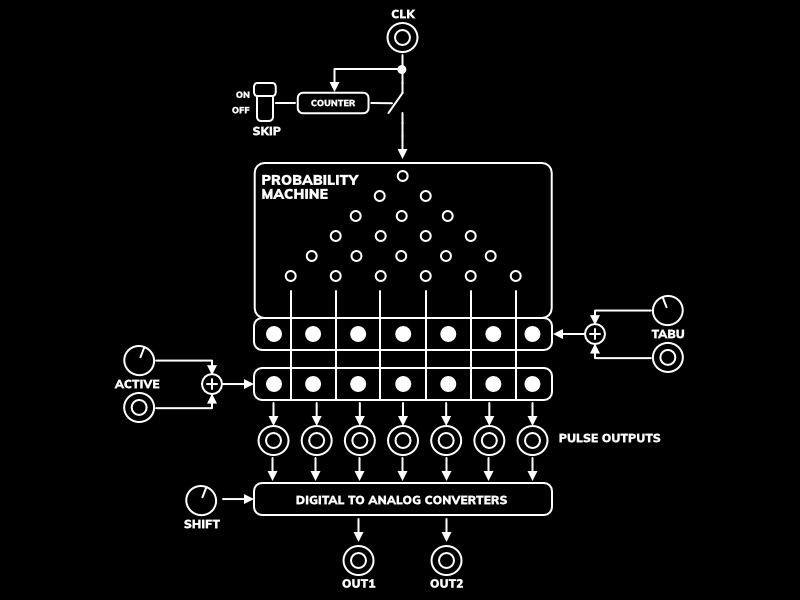

+++
title = "Quincunx"
date = "2017-10-28T22:37:03+03:00"
layout = "module"
image ="../images/Quincunx.png"
+++

Included in: <a href="/mysteries/" class="btn btn-primary" role="button">VultMysteries</a> 

Quincunx is based on the machine with the same name, also known as "bean machine" or "Galton board". Quincunx simulates this machine but adds some special features that make it more usable to generate voltages and pulses.

 

Real Quincunx (source wikipedia: https://en.wikipedia.org/wiki/Bean_machine) 

## Basic Use

Connect a clock signal to the input CLK. Every time a pulse is received a bean will be dropped and it will land in one of the seven slots of the machine. Due to the probabilistic nature of the machine, the beans will have a larger probability of landing in the center slots. We can see in the left column of LEDs the slot in which a bean has landed. The probability rules can be altered by the TABU parameter which is inspired by the Tabu Search optimization algorithm. Increasing the TABU number will forbid a bean from falling in the same slot for a certain number of steps. This forces the machine to explore the side slots. Setting the TABU to maximum will make it produce a more repeated sequence of throws.

The slots in which the beans fall are converted to voltages and pulses. The conversion depends on the number of ACTIVE steps. We can see how many bits are active in the right column of LEDs. When generating voltages, the more active steps, the more bits are used to generate an analog signal. The two outputs will generate a number using the two possible orderings of the bits; from left to right and right to left. The position of the bits can be altered with the SHIFT control, which will displace the bits by a given number of positions. The pulses are generated by triggering every output that has an active bit when a clock is received.

Because the machine has seven slots, it tends to produce sequences of odd length. The SKIP switch helps them line up with even bar lengths: when active, one of every eight clocks is skipped, so seven beans are dropped for every eight clock pulses.

 

Quincunx block diagram

## Control Description

- **Clk**: main input clock. Every pulse a new bean is thrown.
- **LEDs(left)**: displays in which slot the last thrown bean fell.
- **LEDs(right)**: displays the number of active bits used to generate the signals.
- **Tabu**: forbids a bean falling in the same slot for the given number of steps.
- **Shift**: shifts the bits used to generate analog signals by the given number of positions.
- **Active**: defines how many of the beans thrown are used as bits to generate analog signals.
- **Skip**: when On, it skips one of every eight clock pulses, so the seven slots line up with an eight step bar.
- **Pulse Outputs**: generate pulses every time a clock is received and the slot is active. The pulses will have the same pulse width as the input clock.
- **Out1 and Out2**: analog outputs generated by using the seven slots as bits. Out1 uses the bits left-to-right and Out2 uses them right-to-left.
