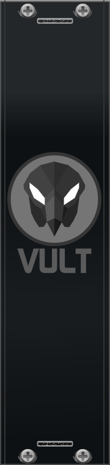

+++
title = "Blank Panels"
date = "2017-10-28T22:37:03+03:00"
layout = "module"
image ="../images/BlackPanelBig.png"
+++

Included in: <a href="/premium/" class="btn btn-primary" role="button">VultModules</a> 

  

The blank panels are an exclusive set of modules for the people that has the paid version. The only function of these panels is to make your Rack look more beautiful by adding the Vult logo.
