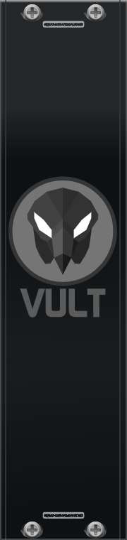
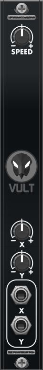

+++
title = "Blank Panels"
description = "Blank panels in 3, 6 and 12 HP that add the Vult logo to your rack."
date = "2017-10-28T22:37:03+03:00"
layout = "module"
image ="../images/BlackPanelBig.png"
+++

<a href="/free/" class="PackageButton" role="button">Part of VultModulesFree</a>

  

The blank panels come in three sizes: 3 HP, 6 HP and 12 HP. Their only function is to make your Rack look more beautiful by adding the Vult logo.
